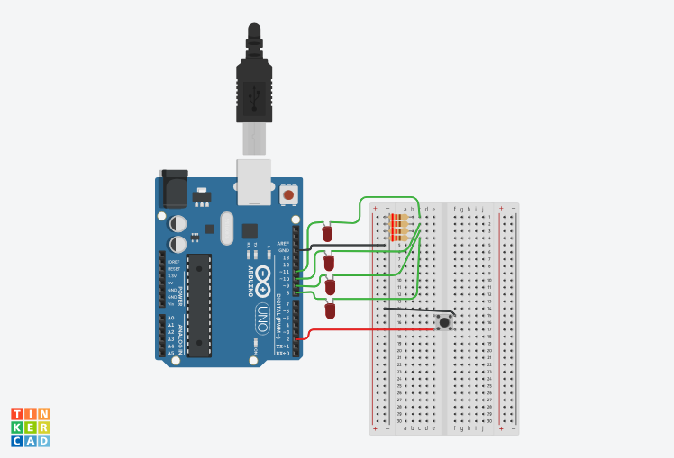

# Contador Binário com Arduino

Contador binário de 4 bits com 4 LEDs (pinos 8 a 11) e um botão (pino 2).

## Como funciona
Com o botão solto, os LEDs fazem um vai-e-vem. Com o botão apertado, o contador binário roda de 0 a 15.